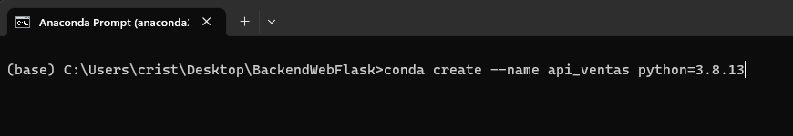

# API VENTAS - CARRITO DE COMPRAS

## Inicio
Para poder inicializar el proyecto, antes debemos configurar un ambiente necesario con todas las dependencias necesarias, y de que esta manera no tengamos ningun problema al ejecutarlo de forma local.

### Pre-Requisitos
Primero que nada, se debe de tener instalado Conda en el ordenador donde se desplegará este proyecto.  
Para ello,puede guiarse de la documentación oficial haciendo click [aquí](https://docs.conda.io/projects/conda/en/latest/user-guide/install/index.html). Una vez ya se halla instalado Conda, podemos continuar con la instalacion.

### Conda Prompt
1. #### Iniciamos con la clonación del proyecto
 ```
    git clone https://github.com/aelvismorales/api_ventas.git
 ``` 
2. #### Iniciamos anaconda prompt y utilizamos el sigueinte codigo

```
    conda create --name api_ventas python=3.8.13
```
3. #### Una vez creado el ambiente lo activamos y creamos las siguientes variables de entorno
```
    conda activate api_ventas
    conda env config vars set FLASK_APP="run:app"
    conda env config vars set APP_CONFIG="default"
```
- FLASK_APP : Variable de entorno que nos permite indicarle a python como ha de ejecutarse el API, ejemplo
**"run( archivo.py en nuestra raiz de carpetas):app( nombre de la variable asignada a inicializar el api)"**
- APP_CONFIG : Variable de entorno quenos permite indicar como vamos a trabajar con la API, en donde tenemos: **development**, **testing**,  **production** como opciones.

4. #### Instalacion de dependencias necesarias
Aqui debemos utilizar el siguiente codigo en nuestro anaconda prompt.
```
    pip install -r requirements.txt
```
Esto comenzara a descargar todas las dependencias necsarias para iniciar el proyecto API_VENTAS.

5. #### Descargar MYSQL como base de datos: 
[Instalar_MYSQL](https://www.youtube.com/watch?v=MeQZJNFTdXM)  
Una vez instalado MYSQL deberas crear una conexion, **RECUERDA** la contraseña de tu base de datos asignada al momento de descargar MYSQL. 


Completado este paso crear una **Squema** llamado ferreteria (nombre_utilizado_en_las_configuraciones), puedes utilizar este codigo dentro de los scripts de Mysql, no te preocupes por las tablas estas se crean de forma automatica cuando inicies el proyecto.
```
    CREATE SCHEMA `ferreteria` ; 
```

6. #### Finalmente
Si completaste todos los pasos puedes ejecutar el siguiente codigo, para iniciar el proyecto:
Recuerda que debes estar dentro de la carpeta donde clonaste el proyecto y tener el ambiente virtual de api_ventas activado.

```
    flask run `or` python run.py
```

## RUTAS
Para comprobar su funcionamiento puedes utilizar POSTMAN u otra herramienta de verificación de APIS.
### Comprador:
Puedes utilizar las siguiente rutas de Comprador, recuerda que si quieres mas informacion del formato puedes ingresar a la carpeta **./routes/** , en donde estan los archivos .py que contienen todas las rutas y el detalle de cada uno de estas junto con su formato.  
- localhost:5000/comprador/crear 
- localhost:5000/comprador/crear/varios 
- localhost:5000/comprador/buscar/<string:texto_dni>
- localhost:5000/comprador/actualizar/<int:id_>
- localhost:5000/comprador/eliminar/<int:id_>
### Producto: 
- localhost:5000/producto/crear
- localhost:5000/producto/crear/varios
- localhost:5000/producto/buscar/<string:texto>
- localhost:5000/producto/productos
- localhost:5000/producto/actualizar/<int:id_>
- localhost:5000/producto/eliminar/<int:id_>
### Venta:
- localhost:5000/venta/crear
- localhost:5000/venta/ver/<int:id_>
- localhost:5000/venta/buscar/<string:com_name>
- localhost:5000/venta/buscar/fechas
- localhost:5000/venta/actualizar/<int:ven_id>
- localhost:5000/venta/eliminar/<int:ven_id>